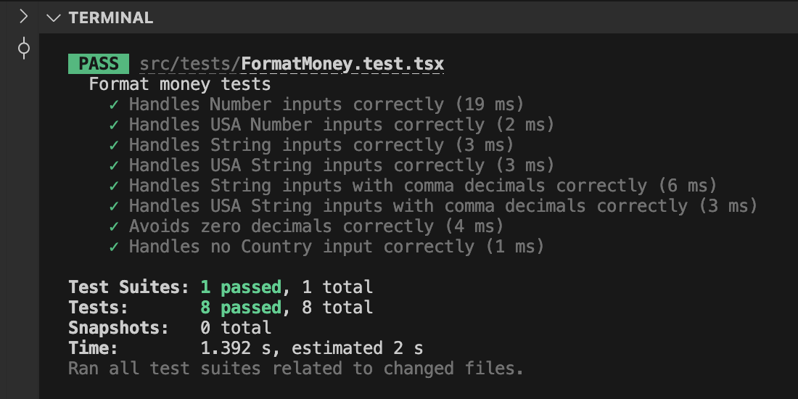

## All tests passed | use with yarn test

<div>
  
</div>

## Run tests

#### To run the tests run in terminal

```
 yarn test
```

## Params

#### The main function accepts some necessary and optional props

| Necessary Props | Type             | example                    |
| --------------- | ---------------- | -------------------------- |
| amount          | string OR number | 123.45, "123.45", "123,45" |
| country         | string           | "EUR", "USD", "GBP"        |

| Optional Props    | Type    | default value |
| ----------------- | ------- | ------------- |
| avoidZeroDecimals | boolean | false         |
| separateDecimals  | boolean | false         |
| showMinusSign     | boolean | false         |

## Examples of use

```javascript
const formattedMoney = formatMoney({ amount: "123.45", country: "EUR" })

/**
 formattedMoney = {
    money: "123,45",
    currencySymbol: "€",
  }
 * /
```

```javascript
const formattedMoney = formatMoney({ amount: "123.456", country: "USD" })

/**
 formattedMoney = {
    money: "123,45",
    currencySymbol: "$",
  }
 * /
```

```javascript
const formattedMoney = formatMoney({ amount: "123.456", country: "GBP" })

/**
 formattedMoney = {
    money: "123,45",
    currencySymbol: "£",
  }
 * /
```

- Error cases

```javascript
const formattedMoney = formatMoney({ amount: "123.45", country: 12345 })

/**
 formattedMoney = {
    money: "",
    decimalPart: "",
    currencySymbol: "",
    error : "The country is not a valid input."
  }
 * /
```

```javascript
const formattedMoney = formatMoney({ amount: "Hello!!!", country: "EUR" })

/**
 formattedMoney = {
    money: "",
    decimalPart: "",
    currencySymbol: "",
    error : "The amount is not a valid input."
  }
 * /
```

### HINTS:

- You can work also with the optional params and get fully customized results, apply them different styles, sizes, etc.

## Expand

### Add more countries support simply by adding the specific countries details the objects in lines:

- Line 22: currencyPosition
- Line 28: formatByCountry

# Getting Started with Create React App

This project was bootstrapped with [Create React App](https://github.com/facebook/create-react-app).

## Available Scripts

In the project directory, you can run:

### `yarn start`

Runs the app in the development mode.\
Open [http://localhost:3000](http://localhost:3000) to view it in the browser.

The page will reload if you make edits.\
You will also see any lint errors in the console.

### `yarn test`

Launches the test runner in the interactive watch mode.\
See the section about [running tests](https://facebook.github.io/create-react-app/docs/running-tests) for more information.

### `yarn build`

Builds the app for production to the `build` folder.\
It correctly bundles React in production mode and optimizes the build for the best performance.

The build is minified and the filenames include the hashes.\
Your app is ready to be deployed!

See the section about [deployment](https://facebook.github.io/create-react-app/docs/deployment) for more information.

### `yarn eject`

**Note: this is a one-way operation. Once you `eject`, you can’t go back!**

If you aren’t satisfied with the build tool and configuration choices, you can `eject` at any time. This command will remove the single build dependency from your project.

Instead, it will copy all the configuration files and the transitive dependencies (webpack, Babel, ESLint, etc) right into your project so you have full control over them. All of the commands except `eject` will still work, but they will point to the copied scripts so you can tweak them. At this point you’re on your own.

You don’t have to ever use `eject`. The curated feature set is suitable for small and middle deployments, and you shouldn’t feel obligated to use this feature. However we understand that this tool wouldn’t be useful if you couldn’t customize it when you are ready for it.

## Learn More

You can learn more in the [Create React App documentation](https://facebook.github.io/create-react-app/docs/getting-started).

To learn React, check out the [React documentation](https://reactjs.org/).
